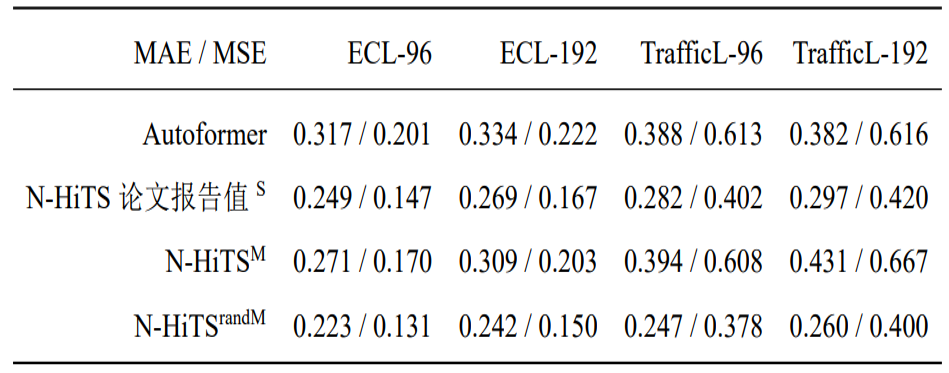

# Extending N-HiTS to Multivariate Forecasting

[Neural Hierarchical Interpolation for Time Series](https://arxiv.org/abs/2201.12886) (N-HiTS) is a MLP-based SOTA univariate forecasting model. This repo logs the efforts to include multivariate (global) information in N-HiTS.

## ./model

- `nhits.py`: A fork from [the official impl](https://github.com/cchallu/n-hits/blob/a71f191d3f7dfc7e5bc1d164f26acc95a7e91e88/src/models/nhits/nhits.py), with some dead code removed.
- `TLAE.py`: Basis-decomposition approach. Replaced the GRU in TLAE with nhits.
- `mixer.py`: Encoder modules doing $\mathbb{R}^{n\times L} \to \mathbb{R}^{n\times L}$, where $n$ is total entities and $L$ is sequence length.
- `MixerNHI.py`: GNN-like approach. Use the modules in `mixer.py` to enrich each ts with global information, then predict each ts with nhits. A clear two-stage assembled model.
- (Unused) `norm.py`: `RevIN` wrapped [Reversible Instance Norm](https://openreview.net/pdf?id=cGDAkQo1C0p) as a module. 
- (Unused) `DFGN.py`: contains *Distinct Filter Generation Network* as described in [EnhanceNet: Plugin Neural Networks for Enhancing Correlated Time Series Forecasting](https://ieeexplore.ieee.org/document/9458855)

## ./data

Get `ECL`, `TrafficL` dataset from [Autoformer](https://cloud.tsinghua.edu.cn/d/e1ccfff39ad541908bae/). For example, `./data/TrafficL.npy` contains an ndarray of the shape (862, 17000+). Get the datasets used by [TLAE](https://arxiv.org/abs/2101.10460) from [here](https://github.com/Guan-t7/myTLAE#data).

## Results

### N-HiTS
- Reproduced nhits reported result using a simplified data pipeline. (superscript "S")
- Found that for the same model code, using a multivarite dataloader which slides training windows sequentially (like the one in [DeepGLO](https://github.com/rajatsen91/deepglo/blob/master/DeepGLO/data_loader.py)) leads to bad convergence. (superscript "M")
- Found that nhits result can be further improved upon reported by ~10%, if we replace the original dataloader with a random-sampling, multivarite dataloader for training. (superscript "randM")

 <!--  -->

### TLAE
Evaluated N-HiTS on TLAE `traffic` dataset. The metrics show that we need better decomposition design to beat the univariate N-HiTS.

| WAPE/MAPE/SMAPE | TLAE              | N-HiTS            | N-HiTS in TLAE    |
|-----------------|-------------------|-------------------|-------------------|
| traffic         | 0.117/0.137/0.108 | 0.075/0.100/0.076 | 0.101/0.114/0.089 |

### GNN
Evaluated `MixerNHI.py`. Metrics improved on TLAE `traffic` dataset. No improvements on `electricity`, `ECL` and `TrafficL`.
`MixNHI-emb` below restricts Fully-Connected layer between ts in mixer ($\mathbb{R}^{n} \to \mathbb{R}^{n}$) as node embedding similarity: $\mathbf{W} = \mathbf{M}\_{1} \mathbf{M}\_{2}^{T}$ , where $\mathbf{M}\_{i} \in \mathbb{R}^{n \times d\_{e}}$

| WAPE/MAPE/SMAPE | electricity       | traffic           |
|-----------------|-------------------|-------------------|
| N-HiTS          | 0.059/0.090/0.080 | 0.075/0.100/0.076 |
| MixNHI          | 0.058/0.096/0.086 | 0.049/0.076/0.055 |
| MixNHI-emb      | 0.055/0.095/0.082 | 0.069/0.095/0.071 |

We also tried to emulate communication between series *inside* the nhits blocks by inserting GNN and Attention layers. It shows no improvements. (code not included) 

### env
Tested on a GeForce RTX 2080 Ti, using these packeges:

```
Python 3.9.9
torch 1.10.0
pytorch-lightning 1.5.10
nni 2.7
```
